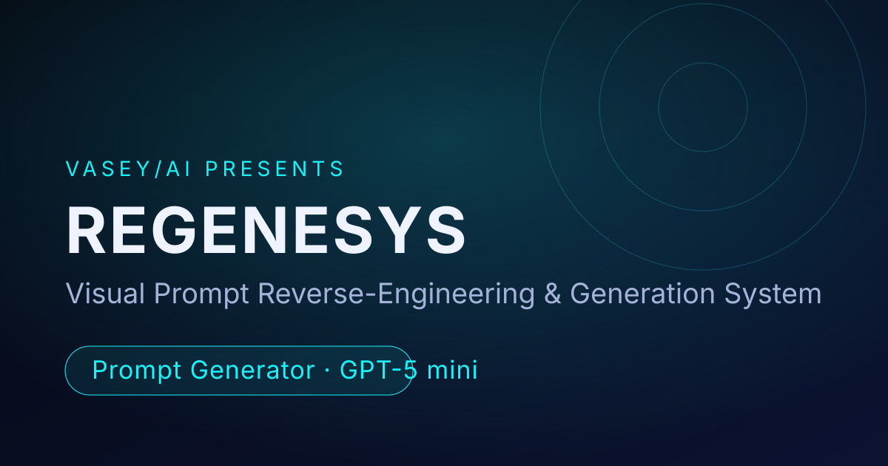

<p align="center">
  
</p>

<h1 align="center">REGENESYS</h1>

<p align="center">
  <strong>Visual Prompt Reverse-Engineering & Generation System</strong><br/>
  Upload images, deconstruct their visual DNA, and generate production-ready prompts for any major generative AI platform.
</p>

<p align="center">
  <a href="https://github.com/SeanVasey/REGENESYS/actions/workflows/ci.yml"></a>
  
  
  = 22" />
  
  
  
</p>

---

<p align="center">
  
</p>

---

## Features

- **Single Image Analysis** — Reverse-engineer a full generative prompt from one image
- **Multi-Image Hybrid** — Synthesize shared visual DNA across multiple images into a unified prompt
- **Negative Prompt Generation** — Identify what an image avoids and generate exclusion prompts
- **Metadata Assembly** — Extract structured tags, style classifications, and modular descriptors
- **Style Transfer** — Extract pure visual style from source images and apply to a new subject
- **Variation Engine** — Generate controlled prompt variants with adjustable axes (color, mood, style, composition)
- **10 Platform Targets** — Universal, Midjourney, DALL-E, Stable Diffusion, Flux, Runway ML, Ideogram, Kling, Sora, Leonardo
- **3 Detail Levels** — Concise, Standard, Production-grade output
- **Prompt History** — Persistent local history (survives reloads) with recall, timestamps, and removal
- **Export** — Download generated prompts as `.txt` files
- **Flexible Upload** — Drag-and-drop, file picker, or paste from clipboard, with 20MB/type validation
- **Accessible by Default** — Keyboard focus rings and `prefers-reduced-motion` support

## Tech Stack

| Layer | Technology |
|-------|-----------|
| Frontend | React 18, Vite 6 |
| Styling | CSS-in-JS (inline styles with design tokens) |
| AI Backend | OpenAI GPT-5 mini API (`gpt-5-mini-2025-08-07`) |
| Testing | Vitest, React Testing Library (65 tests) |
| Linting | ESLint 9 with React Hooks & Refresh plugins |
| CI/CD | GitHub Actions (lint, test, build) |
| Fonts | Bebas Neue, Reddit Sans, JetBrains Mono |

## Getting Started

### Prerequisites

- Node.js 22+ and npm
- An OpenAI API key ([get one here](https://platform.openai.com/api-keys))

### Setup

```bash
git clone https://github.com/SeanVasey/REGENESYS.git
cd REGENESYS
npm install
cp .env.example .env
```

Edit `.env` and add your OpenAI API key:

```bash
VITE_OPENAI_API_KEY=your_openai_api_key_here
```

### Run

```bash
npm run dev
```

Opens at `http://localhost:5173`.

### Build

```bash
npm run build
npm run preview   # preview the production build
```

### Test

```bash
npm test          # run all tests
npm run test:watch # watch mode
npm run lint      # eslint
```

## Environment Variables

Documented in [`.env.example`](.env.example):

| Variable | Description |
|----------|-----------|
| `VITE_OPENAI_API_KEY` | OpenAI API key for visual analysis (GPT-5 mini) |

For Vercel deployment, add `VITE_OPENAI_API_KEY` as an environment variable in
your project settings. Also update Open Graph URLs in `index.html` to match
your production domain (`og:url`, `og:image`, `twitter:image`).

## Repository Structure

```text
.
├── public/
│   ├── regenesys-icon.svg          # App icon (dark tile) — favicon + PWA source
│   ├── regenesys-icon-optimized.svg # Transparent glyph — in-app logo + mask-icon
│   ├── favicon.ico                 # Multi-size favicon (16/32/48)
│   ├── og-image.svg                # Social sharing Open Graph image
│   ├── icon-192.png / icon-512.png # PWA icons
│   ├── apple-touch-icon.png        # iOS home screen icon
│   └── manifest.json               # PWA manifest
├── src/
│   ├── components/
│   │   ├── AnalysisProgress.jsx    # Animated progress indicator
│   │   ├── HistoryPanel.jsx        # Prompt history panel
│   │   ├── Icons.jsx               # SVG icon components
│   │   ├── NeuralMesh.jsx          # Animated background canvas
│   │   ├── SubjectInput.jsx        # Style transfer subject input
│   │   ├── UI.jsx                  # Glass, SectionLabel, CopyBtn, Collapsible
│   │   └── VariationControls.jsx   # Variation axis sliders
│   ├── lib/
│   │   ├── api.js                  # fetchWithRetry utility
│   │   ├── constants.js            # Modes, platforms, detail levels
│   │   ├── prompts.js              # System/user prompt builders & parser
│   │   └── tokens.js               # VASEY/AI design tokens
│   ├── test/
│   │   ├── api.test.js             # API utility tests
│   │   ├── App.test.jsx            # App component tests
│   │   ├── constants.test.js       # Constants validation tests
│   │   ├── prompts.test.js         # Prompt builder & parser tests
│   │   └── setup.js                # Test environment setup
│   ├── App.jsx                     # Main application component
│   └── main.jsx                    # React entry point
├── .github/workflows/
│   ├── ci.yml                      # GitHub Actions CI pipeline
│   └── ci-local-check.sh           # Local baseline validation
├── tasks/
│   ├── todo.md                     # Active task tracking
│   └── lessons.md                  # Accumulated lessons
├── docs/
│   └── MANIFEST.md                 # Repository artifact inventory
├── scripts/
│   └── generate-icons.mjs          # Icon generation utility
├── index.html                      # Vite entry HTML (with OG metadata)
├── vite.config.js                  # Vite + Vitest configuration
├── eslint.config.js                # ESLint 9 flat config
├── package.json                    # Dependencies and scripts
├── CHANGELOG.md                    # Version history
├── SECURITY.md                     # Vulnerability disclosure
├── CODE_OF_CONDUCT.md              # Community standards
├── CLAUDE.md                       # AI development guidelines
└── LICENSE                         # Apache 2.0
```

## Usage

1. **Select a mode** — Choose from 6 analysis modes depending on your goal
2. **Choose platform** — Pick the target AI platform for optimized prompt syntax
3. **Set detail level** — Concise for quick prompts, Production for full technical specs
4. **Upload image(s)** — Drag and drop or click to upload PNG, JPG, or WebP files
5. **Analyze** — Hit the analyze button and wait for the AI to deconstruct the visual DNA
6. **Copy or export** — Copy individual sections or export the full prompt as a `.txt` file

## Deployment

Build the static site with `npm run build`. The output in `dist/` can be
deployed to any static host (Vercel, Netlify, Cloudflare Pages, GitHub Pages).

For Vercel:

```bash
npx vercel
```

## Contributing

Contributions are welcome. Please open an issue first to discuss proposed
changes. See [CODE_OF_CONDUCT.md](CODE_OF_CONDUCT.md) for community
guidelines.

## License

Apache 2.0 — see [LICENSE](LICENSE) for details.

---

<p align="center">
  <strong>&copy; 2026 VASEY/AI</strong> &middot; REGENESYS v1.3.0<br/>
  A VASEY/AI creation. Part of the Vasey Multimedia content series.
</p>
